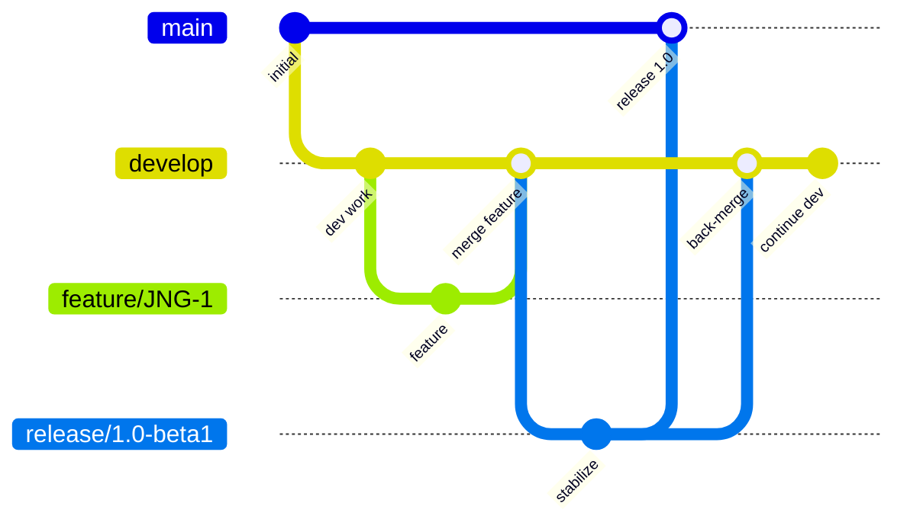
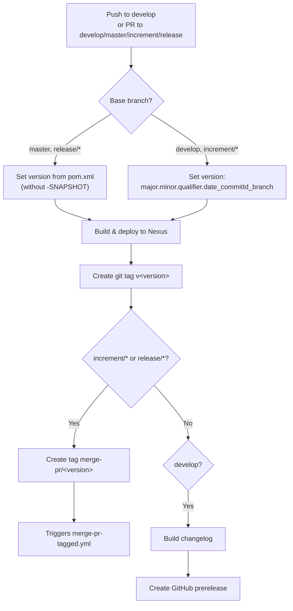
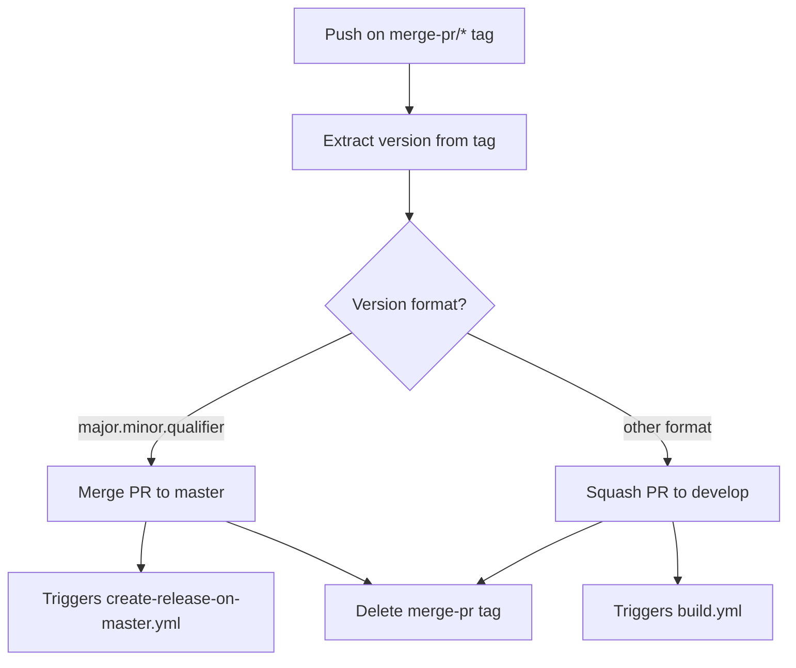
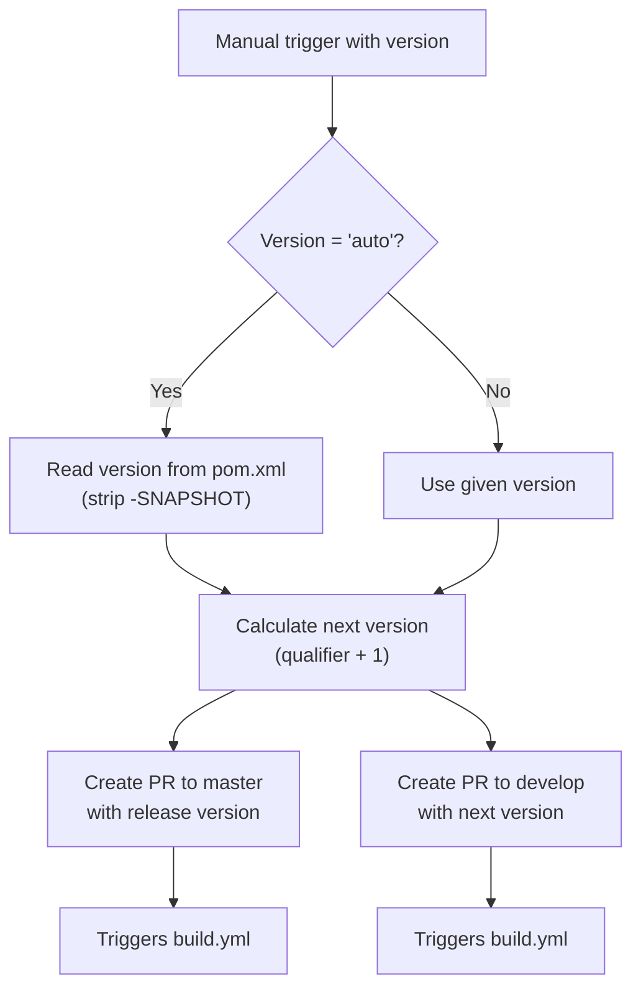

# CI/CD Workflow and Branch Strategy

This document describes the Git branching model and GitHub Actions CI/CD pipelines used by epsilon-runtime. The project follows a GitFlow-based workflow with automated builds, releases, and deployments.

## Branch Strategy

The project uses [GitFlow](https://www.atlassian.com/git/tutorials/comparing-workflows/gitflow-workflow) for branch management:

| Branch Pattern | Base | Purpose |
|---------------|------|---------|
| `develop` | — | Main development branch; contains latest sources of the active version |
| `feature/JNG-XXX_summary` | `develop` | New features for the next release |
| `release/X.Y-betaN` or `X_Y_betaN` | `develop` | Release stabilization branches |
| `bugfix/JNG-XXX_summary` | `release/*` | Bug fixes during release testing (must be applied to newer versions too) |
| `support/JNG-XXX_summary` | `release/*` | Minor changes to a previous release |
| `master` | — | Latest released production sources |
| `hotfix/JNG-XXX_summary` | `master` | Critical fixes applied to both `master` and `develop` |

## Version Numbering

Versions follow semantic versioning with these rules:

1. **Feature branches** — do not change version numbers
2. **Release branch creation** — increment the 2nd number on `develop`
3. **Bugfix branches** — do not change version numbers (they target release branches before merging to master)
4. **Support branches** — increment the 3rd number when started
5. **Hotfix branches** — increment the 4th number when started; applied to both release and master

## GitHub Actions Pipelines

### Build Pipeline (`build.yml`)

Triggered on every push to `develop` and on pull requests targeting `develop`, `master`, `increment/*`, or `release/*`.

### Merge PR Pipeline (`merge-pr-tagged.yml`)

Triggered when a `merge-pr/*` tag is pushed. Determines whether to merge to `master` (for releases) or squash to `develop` (for increments):

### Release on Master (`create-release-on-master.yml`)

Triggered on push to `master`. Builds a changelog and creates a GitHub release (marked as latest).

### Manual Release (`release.yml`)

Manually triggered with a version parameter (or `auto` to use the pom.xml version):

### Other Workflows

| Workflow | Purpose |
|----------|---------|
| `bump-version.yml` | Bumps project version |
| `build-dependabot.yml` | Builds Dependabot PRs |
| `delete-old-draft-releases.yml` | Cleans up old draft releases |
| `jira-description-to-pr.yml` | Copies JIRA ticket descriptions into PR bodies |
| `sync-labels.yml` | Synchronizes GitHub labels |

## Development Rules

> **Important:** There is no commit without a ticket number. Every commit and pull request must reference a JIRA ticket in `JNG-XXX` format.

Issue tracking: [JIRA Dashboard](https://blackbelt.atlassian.net/jira/dashboards)
