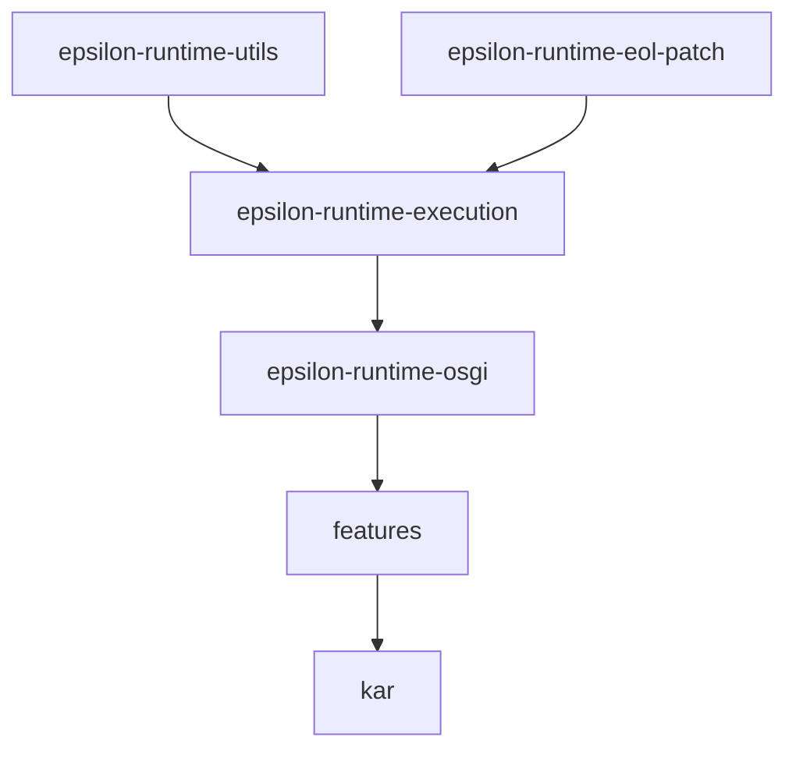
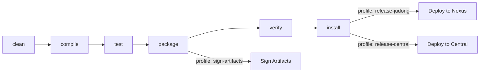

# Contributing to epsilon-runtime

Thank you for your interest in contributing! This guide covers everything you need to get started.

## Development Environment Setup

### Required Tools

| Tool | Version | Notes |
|------|---------|-------|
| **JDK** | 21 | [Zulu JDK](https://www.azul.com/downloads/?version=java-21-lts&package=jdk) recommended |
| **Maven** | 3.9.4+ | Or use the included Maven wrapper (`./mvnw`) |

### Verify Your Setup

```bash
# Check Java version (should show 21+)
java -version

# Check Maven version (should show 3.9.4+)
mvn -version

# Build the project
./mvnw clean install
```

## Project Structure

This is a multi-module Maven project with 7 modules. The core logic lives in `epsilon-runtime-execution`, which provides the `ExecutionContext` builder API for running Epsilon scripts against EMF, XML, and Excel models. See the [README](README.md) for a full architecture overview with diagrams.



## Submitting an Issue

Before creating a new issue, please search the [issue tracker](https://github.com/BlackBeltTechnology/epsilon-runtime/issues) to check if your problem has already been reported.

When filing a bug report, include:

- Output of `java -version` and `mvn -version`
- Your `pom.xml` or `.flattened-pom.xml` (if relevant)
- A **minimal reproduction** — a small, self-contained test case that demonstrates the problem

> **Note:** We will request a minimal reproduction for all bug reports. This helps us confirm the issue quickly and ensures we fix the right problem.

File new issues using the [issue form](https://github.com/BlackBeltTechnology/epsilon-runtime/issues/new/choose).

## Submitting a Pull Request

This project follows [GitHub's standard forking model](https://guides.github.com/activities/forking/). Fork the repository and submit pull requests from your fork.

### Build Lifecycle



### Common Build Commands

```bash
# Full build with tests
./mvnw clean install

# Build without tests (faster iteration)
./mvnw clean install -DskipTests

# Run tests only
./mvnw clean test

# Run a single test
./mvnw -pl epsilon-runtime-execution test -Dtest=ExecutionContextTest
```
