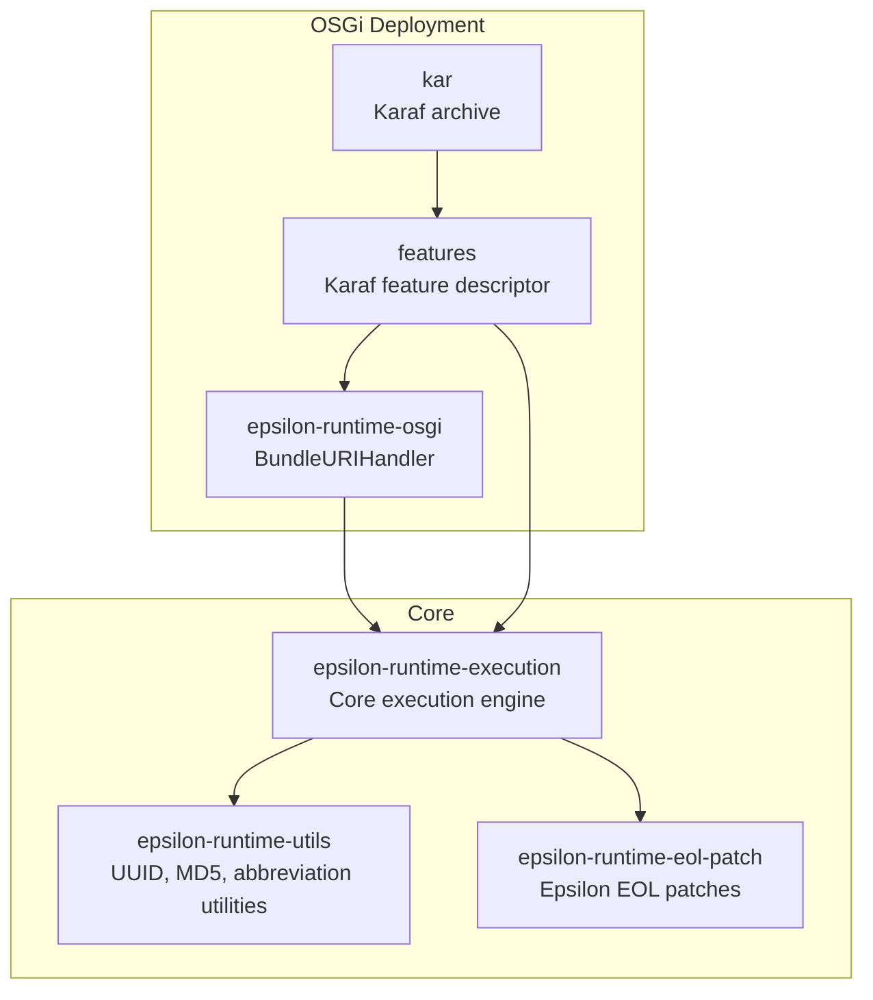
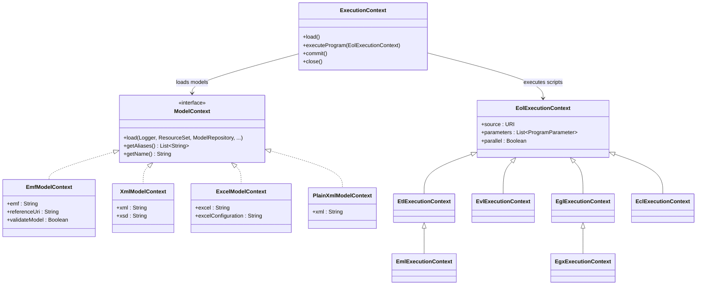
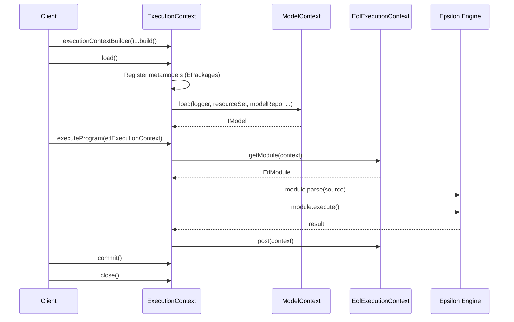
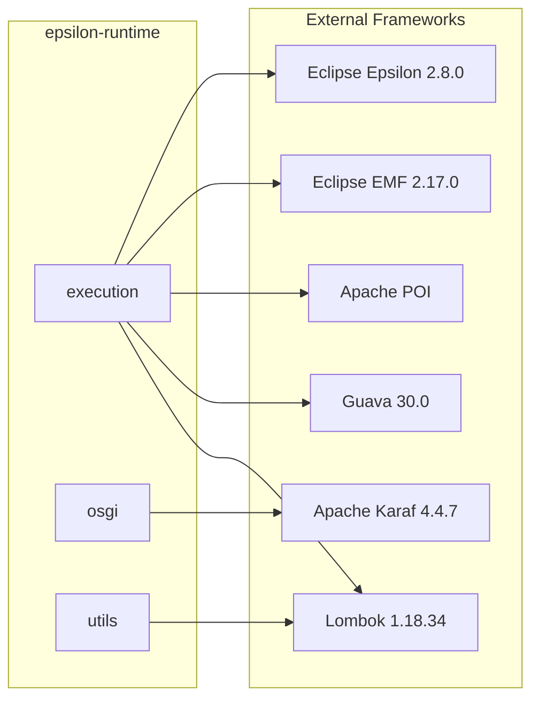

# epsilon-runtime

[](https://github.com/BlackBeltTechnology/epsilon-runtime/actions/workflows/build.yml)

Eclipse Epsilon Runtime for Maven and OSGi. This library provides builders, helper classes, and URI handlers that allow you to run [Eclipse Epsilon](https://www.eclipse.org/epsilon/) model transformation and validation scripts outside the Eclipse IDE — from plain Maven projects or Apache Karaf containers.

## What is Epsilon?

[Epsilon](https://www.eclipse.org/epsilon/) is a family of languages and tools for **code generation**, **model-to-model transformation**, **model validation**, **comparison**, **migration**, and **refactoring**. It works out of the box with EMF, UML, Simulink, XML, and other model types.

This runtime supports the following Epsilon language dialects:

| Language | Full Name | Purpose |
|----------|-----------|---------|
| **EOL** | Epsilon Object Language | General-purpose model querying and modification |
| **ETL** | Epsilon Transformation Language | Model-to-model transformation |
| **EVL** | Epsilon Validation Language | Model validation with constraints |
| **EGL** | Epsilon Generation Language | Template-based code generation |
| **EGX** | EGL Co-Ordination Language | Orchestrates multiple EGL templates |
| **EML** | Epsilon Merging Language | Model merging |
| **ECL** | Epsilon Comparison Language | Model comparison |

> **Tip:** For a deep understanding of the Epsilon stack, read the free [Epsilon Book](https://www.eclipse.org/epsilon/doc/book/).

## Architecture

### Module Overview



### Core Component Relationships

The central orchestrator is `ExecutionContext`, which wires together metamodels, models, and Epsilon scripts:



### Execution Lifecycle

Every Epsilon script execution follows this sequence:



### External Dependencies



## Example: EMF-to-Liquibase Transformation

This walkthrough demonstrates transforming a simple entity model (defined in Ecore) into [Liquibase](https://www.liquibase.org/) database changelog XML. The transformation reads EMF model instances and produces XML output conforming to the Liquibase XSD schema.

### 1. Define a metamodel

The metamodel (`.ecore` file) describes the structure of your domain — here, a simple data model with entities, attributes, and references:

```xml
<?xml version="1.0" encoding="UTF-8"?>
<ecore:EPackage xmi:version="2.0" xmlns:xmi="http://www.omg.org/XMI"
    xmlns:xsi="http://www.w3.org/2001/XMLSchema-instance"
    xmlns:ecore="http://www.eclipse.org/emf/2002/Ecore"
    name="data" nsURI="http://www.blackbelt.hu/epsilon-runtime/test" nsPrefix="data">
  <eClassifiers xsi:type="ecore:EClass" name="DataModel">
    <eStructuralFeatures xsi:type="ecore:EAttribute" name="name"
        eType="ecore:EDataType http://www.eclipse.org/emf/2002/Ecore#//EString"/>
    <eStructuralFeatures xsi:type="ecore:EReference" name="entity" upperBound="-1"
        eType="#//Entity" containment="true"/>
  </eClassifiers>
  <eClassifiers xsi:type="ecore:EClass" name="Entity">
    <eStructuralFeatures xsi:type="ecore:EAttribute" name="name"
        eType="ecore:EDataType http://www.eclipse.org/emf/2002/Ecore#//EString"/>
    <eStructuralFeatures xsi:type="ecore:EReference" name="attribute" lowerBound="1"
        upperBound="-1" eType="#//Attribute" containment="true"/>
    <eStructuralFeatures xsi:type="ecore:EReference" name="reference" upperBound="-1"
        eType="#//EntityReference" containment="true"/>
  </eClassifiers>
  <eClassifiers xsi:type="ecore:EClass" name="Attribute">
    <eStructuralFeatures xsi:type="ecore:EAttribute" name="name"
        eType="ecore:EDataType http://www.eclipse.org/emf/2002/Ecore#//EString"/>
    <eStructuralFeatures xsi:type="ecore:EAttribute" name="type"
        eType="ecore:EDataType http://www.eclipse.org/emf/2002/Ecore#//EString"/>
  </eClassifiers>
  <eClassifiers xsi:type="ecore:EClass" name="EntityReference">
    <eStructuralFeatures xsi:type="ecore:EAttribute" name="name"
        eType="ecore:EDataType http://www.eclipse.org/emf/2002/Ecore#//EString"/>
    <eStructuralFeatures xsi:type="ecore:EAttribute" name="toMany"
        eType="ecore:EDataType http://www.eclipse.org/emf/2002/Ecore#//EBoolean"/>
    <eStructuralFeatures xsi:type="ecore:EReference" name="target" lowerBound="1"
        eType="#//Entity"/>
  </eClassifiers>
</ecore:EPackage>
```

> **Note:** You can also use the Emfatic (`.emf`) format and convert between `.ecore` and `.emf` within Eclipse.

### 2. Define a model instance

The model file (`.model` / XMI) conforms to the metamodel and contains actual data:

```xml
<?xml version="1.0" encoding="ASCII"?>
<data:DataModel xmi:version="2.0" xmlns:xmi="http://www.omg.org/XMI"
    xmlns:data="http://www.blackbelt.hu/epsilon-runtime/test">
  <entity name="Test1">
    <attribute name="attr1" type="String"/>
  </entity>
  <entity name="Test2">
    <attribute name="attr2" type="String"/>
    <reference name="test1" target="_Ds1OEEAJEemOdvXw1zCXyw"/>
  </entity>
</data:DataModel>
```

### 3. Define transformation rules (ETL)

The ETL script maps source model elements to Liquibase XML elements:

```etl
rule DataModelToChangeLog
    transform s : TEST1!DataModel
    to t : LIQUIBASE!databaseChangeLog {
}

rule EntityToCreateTable
    transform s : TEST1!Entity
    to t : LIQUIBASE!CreateTable {
        t.tableName = s.name;
        TEST1!DataModel.all.selectOne(e | e.entity.contains(s))
            .equivalent("DataModelToChangeSet").createTable.add(t);
}

rule AttributeToColumn
    transform s : TEST1!Attribute
    to t : LIQUIBASE!Column {
        t.name = s.name;
        t.type = s.type;
        TEST1!Entity.all.selectOne(e | e.attribute.contains(s))
            .equivalent("EntityToCreateTable").column.add(t);
}
```

### 4. Run the transformation (Java)

```java
// Set up a custom URI handler for resolving model files
URIHandler uriHandler = new NioFilesystemnRelativePathURIHandlerImpl(
    "urn", FileSystems.getDefault(), new File(targetDir(), "test-classes").getAbsolutePath());

ResourceSet executionResourceSet = new CachedResourceSet();
executionResourceSet.getURIConverter().getURIHandlers().add(0, uriHandler);

// Build and run the execution context
ExecutionContext executionContext = executionContextBuilder()
    .log(slf4jLogger)
    .resourceSet(executionResourceSet)
    .metaModels(ImmutableList.of("urn:epsilon-runtime-test.ecore"))
    .modelContexts(ImmutableList.of(
        emfModelContextBuilder()
            .log(slf4jLogger)
            .name("TEST1")
            .emf("urn:epsilon-runtime-test1.model")
            .build(),
        xmlModelContextBuilder()
            .log(slf4jLogger)
            .name("LIQUIBASE")
            .xsd(new File(targetDir(), "test-classes/liquibase.xsd").getAbsolutePath())
            .xml("urn:epsilon-transformedliquibase.xml")
            .readOnLoad(false)
            .storeOnDisposal(true)
            .build()))
    .sourceDirectory(scriptDir())
    .build();

executionContext.load();
executionContext.executeProgram(
    etlExecutionContextBuilder()
        .source("transformTest1ToLiquibase.etl")
        .build());
executionContext.commit();
executionContext.close();
```

### 5. Output

The transformation produces valid Liquibase XML:

```xml
<?xml version="1.0" encoding="UTF-8"?>
<databaseChangeLog xmlns="http://www.liquibase.org/xml/ns/dbchangelog">
  <changeSet author="test1toliquibase">
    <createTable tableName="Test1">
      <column name="ID" type="Identifier"/>
      <column name="attr1" type="String"/>
    </createTable>
    <createTable tableName="Test2">
      <column name="ID" type="Identifier"/>
      <column name="attr2" type="String"/>
      <column name="ID_test1" type="Identifier"/>
    </createTable>
    <addForeignKeyConstraint baseColumnNames="ID_Test1" baseTableName="Test2"
        constraintName="FK_Test2_Test1" referencedColumnNames="ID" referencedTableName="Test1"/>
    <addPrimaryKey columnNames="ID" tableName="Test1"/>
    <addPrimaryKey columnNames="ID" tableName="Test2"/>
  </changeSet>
</databaseChangeLog>
```

## Contributing

Everyone is welcome to contribute! Please read the [Contributing Guide](CONTRIBUTING.md) for details.

## License

This project is licensed under the [Apache License 2.0](https://www.apache.org/licenses/LICENSE-2.0).
